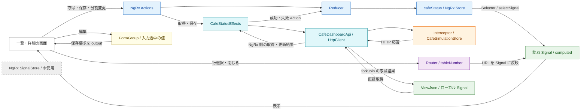

# 実装から読み解く NgRx・Signal・SignalStore の状態管理

調査日: 2026-10-02

## 1. 対象と読み方

この資料は `src/` の TypeScript・HTML と `package.json` を根拠に、現在の実装の状態管理を説明する。設計書・PRD・計画資料・既存の説明資料は参照していない。テストコードは実装上の振る舞いを補足するために確認した。

以下の「実装事実」はコードから直接確認できる内容、「読み取れる思想」はその配置・依存関係・更新方法からの推論。作者の意図や将来の方針を確定するものではない。

**この実装の中心は、NgRx Store に一覧・詳細で共有する取得済みデータを置き、Angular Signal を画面との接続・派生値・局所状態に使う構成である。NgRx SignalStore は使われていない。**

## 2. 色で見る状態の配置

色だけでなく、名称でも担当を区別する。

| 色        | 担当                  | 実際に持つもの                                                            |
| --------- | --------------------- | ------------------------------------------------------------------------- |
| 🟦 青     | NgRx Store            | `dashboard`、取得・更新の状態、分割比率                                   |
| 🟩 緑     | Angular Signal        | Store の読取口、URL の読取結果、派生値、編集中フラグ、JSON 画面の取得結果 |
| 🟪 紫     | Router / URL          | 選択テーブルと詳細ペインを開く経路                                        |
| 🟨 黄     | Reactive Forms        | 編集中の `status`・`people`・`billingAmount`                              |
| 🟧 橙     | 擬似バックエンド      | 自律変化する店内状態、来客・注文・予約                                    |
| 🟦🟩 水色 | RxJS / Effects / HTTP | 要求の実行順、API 呼出し、成功・失敗への変換                              |
| ⬜ 灰     | SignalStore           | 未使用。現在の状態所有者としては存在しない                                |



図の往復矢印は要求と応答の責務を要約している。実際には `HttpClient` の Observable を Effects が購読し、Interceptor が応答を返す。`changeSplitPercent` は Reducer だけで処理され、API 呼出しは発生しない。

### 状態ごとの正本

| 状態                           | 正本・所有者                             | 画面側の扱い                                       |
| ------------------------------ | ---------------------------------------- | -------------------------------------------------- |
| 自律変化する店内の現在値       | `CafeSimulationStore` の通常のフィールド | 直接参照せず HTTP 経由でスナップショットを取得     |
| 一覧・詳細で共有する取得済み値 | `CafeStatusState.dashboard`              | 各画面が同じ `selectDashboard` から読む            |
| 選択テーブル                   | URL の `:tableNumber`                    | 親・詳細・Overview がそれぞれ URL を Signal に反映 |
| 詳細ペインの開閉               | URL に対象テーブルがあるか               | `selectedTableNumber() !== null` で表示を決める    |
| 分割比率                       | `CafeStatusState.splitPercent`           | ドラッグ終了時だけ Action で確定                   |
| 編集中の値                     | `CafeInfoHeader.form`                    | 保存時に要求へ変換。Store の値とは別に保持         |
| 編集欄を開いているか           | `CafeInfoHeader.editing`                 | コンポーネント内の `signal(false)`                 |
| JSON 画面の取得結果と通信状態  | `ViewJson` のローカル Signal             | `cafeStatus` の Store を経由しない                 |

「正本」は状態ごとの更新責任を指す。バックエンドの現在値、画面の取得済み値、入力途中の値は取得・編集時点が異なるので、常に同じ値になるという意味ではない。

## 3. 🟦 NgRx Store: 共有する取得済み値と操作状態

### 登録と共有範囲

実装事実:

- アプリケーション側で `provideStore()` を登録している。
- `cafe-status` ルートで `provideState('cafeStatus', cafeStatusReducer)` と `provideEffects(CafeStatusEffects)` を登録している。
- 一覧の `CafeTables`、詳細の `BaseCafeTableOutput`、その子の `CafeTableOverview` が同じ Selector を読む。
- `ViewJson` とメニュー画面の `Dashboard` はこの feature の Store を読まない。

根拠: [app.config.ts](src/app/app.config.ts) L12–17、[app.routes.ts](src/app/app.routes.ts) L23–52、[cafe-tables.ts](src/app/webapp-common/cafe-tables/cafe-tables.ts) L28–33、[base-cafe-table-output.ts](src/app/webapp-common/cafe-tables/containers/cafe-table-output/base-cafe-table-output.ts) L23–35、[cafe-table-overview.ts](src/app/feature/cafe-status/containers/cafe-table-overview/cafe-table-overview.ts) L20–29。

読み取れる思想: 共通の Store 基盤に、カフェ一覧と詳細で共有する feature の状態を登録する。詳細だけで別 API を取得する構成にはせず、一覧と詳細の取得済み値を合わせる。

ルートでの provider 登録は確認できるが、画面を離れると必ず State や Effects が破棄・初期化されるという保証は、この実装だけからは断定しない。明示的なリセット Action はない。

### State の全項目

| 項目                  | 初期値  | 担当                                                                             |
| --------------------- | ------- | -------------------------------------------------------------------------------- |
| `dashboard`           | `null`  | スタッフ・座席集計・テーブル配列を含む取得結果                                   |
| `loading`             | `false` | ダッシュボード取得の状態                                                         |
| `loadError`           | `null`  | ダッシュボード取得のエラー                                                       |
| `updatingTableNumber` | `null`  | 最後に dispatch された更新要求のテーブル番号。通信実行中の全件を表すものではない |
| `updateError`         | `null`  | テーブル番号と更新エラーメッセージの組                                           |
| `splitPercent`        | `65`    | 詳細表示時の一覧側の幅の割合                                                     |

根拠: [cafe-status.reducer.ts](src/app/feature/cafe-status/state/cafe-status.reducer.ts) L14–32。

選択テーブルのオブジェクト、詳細ペイン開閉フラグ、入力途中のフォーム値は State に入っていない。また、`dashboard.tables` は配列として保持されており、ID 辞書・NgRx Entity への正規化は行っていない。

`readonly` の型と Reducer のオブジェクト展開・`map` により、画面の共有値を置き換えて更新する。これは TypeScript 上の制約と更新方法の話であり、`readonly` 自体が実行時の深い凍結を保証するわけではない。

### Action と更新規則

| Action                 | Reducer が変えるもの                                                                       | 非同期処理 |
| ---------------------- | ------------------------------------------------------------------------------------------ | ---------- |
| `loadDashboard`        | `loading = true`、`loadError = null`。既存の `dashboard` は残す                            | GET        |
| `loadDashboardSuccess` | `dashboard` 全体を応答値で置換、`loading = false`                                          | なし       |
| `loadDashboardFailure` | `loading = false`、`loadError` を記録。既存の `dashboard` は残す                           | なし       |
| `updateTable`          | 対象番号を記録、`updateError = null`。テーブル値は変えない                                 | PUT        |
| `updateTableSuccess`   | 同じ `tableNumber` のテーブルだけを応答値で置換。記録中の番号と一致したら更新中状態を解除  | なし       |
| `updateTableFailure`   | 対象番号とメッセージを記録。記録中の番号と一致したら更新中状態を解除。テーブル値は変えない | なし       |
| `changeSplitPercent`   | `splitPercent` を置換                                                                      | なし       |

根拠: [cafe-status.actions.ts](src/app/feature/cafe-status/state/cafe-status.actions.ts) L11–41、[cafe-status.reducer.ts](src/app/feature/cafe-status/state/cafe-status.reducer.ts) L34–79。

読み取れる思想: **入力値を先に共有 State に書かず、成功応答を受けてから確定する。** 更新が失敗しても取得済みのテーブル値は変わらない。バックエンドが人数・会計金額などを補正できるため、要求値をそのまま確定値として扱わない。

ただし、更新成功は `dashboard` が既にある場合の既存行の置換に限られる。`dashboard === null` のときは一覧を新規生成せず、対象行がないときも追加しない。テーブル以外の `generatedAt`・座席集計・他の行はそのままなので、保存後の全体が同一時点のスナップショットになる保証はない。詳細はレビューの R04 を参照。

### RxJS が決める要求の扱い

| 処理               | 演算子                              | 現在の規則                                         |
| ------------------ | ----------------------------------- | -------------------------------------------------- |
| ダッシュボード取得 | `exhaustMap`                        | 取得中に来た追加の取得要求は通信を開始しない       |
| テーブル更新       | `concatMap`                         | 全テーブルの更新要求を一つの列に並べ、受信順に実行 |
| エラー変換         | 各 API Observable 内の `catchError` | 失敗 Action に変換し、後続要求を処理できる構成     |

取得失敗は固定メッセージ、更新失敗は HTTP 400・404・その他を区別して画面向けメッセージへ変換する。

根拠: [cafe-status.effects.ts](src/app/feature/cafe-status/state/cafe-status.effects.ts) L16–79。

読み取れる思想: 取得は重複通信を抑え、更新は後続要求を捨てずに順番を守る。Reducers が同期的な State 更新を担当し、Effects が HTTP と RxJS の制御を担当する。

取得と更新は別々の Effect であり、`concatMap` が直列化するのは PUT 同士だけである。GET と PUT の応答順は制御されていないため、古い GET が保存成功後に届くと `dashboard` 全体を置換し、保存結果の表示を巻き戻せる。詳細はレビューの R01 を参照。

また、更新要求の Reducer はキュー待ちになる前から番号を上書きする。`updatingTableNumber` は全件の pending 状態を表せず、対象を切り替えて戻る場合まで二重送信を防ぐ保証はない。`updateError` も単一欄で、成功時には消去されないため、前の要求の失敗が後の成功後にも残る場合がある。詳細は R02・R03 を参照。

## 4. 🟩 Angular Signal: Store と画面の接続、派生値、局所状態

### Signal の種類を混同しない

| 形                                   | 使用例                                                                | 所有・更新の意味                                                   |
| ------------------------------------ | --------------------------------------------------------------------- | ------------------------------------------------------------------ |
| `store.selectSignal(selector)`       | `dashboard`、`loading`、`splitPercent`                                | NgRx State の読取口。別の書込可能な Store を作っているわけではない |
| `signal(...)`                        | `selectedTableNumber`、`tableNumber`、`editing`                       | URL を反映する値や局所状態を `.set()` で更新                       |
| `computed(...)`                      | `selectedTable`、`table`、`generatedAt`、対象テーブルの `updateError` | 他の状態から必要な表示値を導出                                     |
| `input(...)` / `input.required(...)` | 一覧の `tables`、詳細ヘッダの `table`・`saving`                       | 親から渡される入力。子が別途取得する必要をなくす                   |
| `toSignal(...)`                      | Overview の親ルートの `tableNumber`                                   | Router の Observable を表示用 Signal に接続                        |
| Angular の `effect(...)`             | 詳細ヘッダのテーブル切替処理                                          | 対象切替時に編集欄を閉じ、FormGroup を初期化                       |

`CafeStatusEffects` の NgRx Effects は API の非同期処理、`CafeInfoHeader` の Angular `effect()` はローカルな編集状態の同期を担当している。同じ「effect」という語でも責務は異なる。

根拠: [cafe-tables.ts](src/app/webapp-common/cafe-tables/cafe-tables.ts) L28–33、[base-cafe-table-output.ts](src/app/webapp-common/cafe-tables/containers/cafe-table-output/base-cafe-table-output.ts) L23–45、[cafe-table-overview.ts](src/app/feature/cafe-status/containers/cafe-table-overview/cafe-table-overview.ts) L20–29、[cafe-info-header.ts](src/app/webapp-common/cafe-tables/dumb/cafe-info-header/cafe-info-header.ts) L30–66。

### 選択テーブルは保存せずに導出する

詳細は次の組合せで表示対象を求める。

```text
NgRx の dashboard.tables + URL 由来の tableNumber
    → computed 内で find
    → 選択テーブル、または null
```

Overview も同じ `selectDashboard` と親ルートの番号からテーブルを求める。詳細専用のテーブルコピーを保存しないため、成功 Action で共有値が変われば一覧・ヘッダ・Overview が同じ取得済みテーブルを表示する。

読み取れる思想: **派生できる値は、別の書込状態として維持しない。** Selector は feature の項目の読取りに集中し、URL と結合した表示対象の導出は各コンポーネントの `computed` に置く。

各コンポーネントは `ChangeDetectionStrategy.OnPush` を指定し、テンプレートで Signal を呼び出して読む構成である。

## 5. 🟪 URL と 🟨 フォームにも状態の担当がある

### URL が選択と詳細ペインの経路を決める

```text
/cafe-status                     一覧
/cafe-status/T01                 T01/overview へリダイレクト
/cafe-status/T01/overview        一覧 + T01 の詳細 + Overview
```

- `BaseCafeEntityPage` は初期読取りと `NavigationEnd` ごとに子ルートの番号を読み、`selectedTableNumber` に反映する。
- 行選択は `Router.navigate()`、詳細を閉じる操作も親ルートへの `navigate()` で行う。
- `BaseCafeTableOutput` は自身の `paramMap` を購読し、Overview は親の `paramMap` を `toSignal` に渡す。
- 親の詳細表示判定は番号の有無で行う。存在しない番号でもペインは開き、取得済み `dashboard` に対象行がなければ not-found を表示する。

根拠: [app.routes.ts](src/app/app.routes.ts) L28–46、[base-cafe-entity-page.ts](src/app/webapp-common/shared/entity-page/base-cafe-entity-page.ts) L12–27、[base-cafe-table-output.ts](src/app/webapp-common/cafe-tables/containers/cafe-table-output/base-cafe-table-output.ts) L38–49、[cafe-tables.html](src/app/webapp-common/cafe-tables/cafe-tables.html) L90–145、[cafe-table-output.html](src/app/webapp-common/cafe-tables/containers/cafe-table-output/cafe-table-output.html) L2–22。

読み取れる思想: URL と別の選択 Action・開閉フラグを二重に更新する必要を減らす。直リンクや戻る・進むでも選択を再現できる。

### フォームは未確定の値を独立して持つ

`CafeInfoHeader` は Store・API・Router を inject せず、親から入力を受けて `saveRequested`・`closeRequested` を通知する。表示部品であっても局所状態は持ち、編集値の正本は Reactive Forms の `FormGroup` である。

編集開始・キャンセル時は現在の入力 `table` からフォームをリセットする。対象テーブル番号の `computed` を Angular `effect()` が監視し、番号が変わったときもリセットする。その中の `untracked` により、`resetForm()` が読むテーブル全体を切替監視の依存に加えない。

そのため、同じ番号のテーブルの取得済み値が更新されても、入力途中の値を上書きしない。保存時には無効なフォームと `saving()` を確認し、`tableNumber` と `getRawValue()` の内容を親へ通知する。

根拠: [cafe-info-header.ts](src/app/webapp-common/cafe-tables/dumb/cafe-info-header/cafe-info-header.ts) L30–96、[cafe-info-header.html](src/app/webapp-common/cafe-tables/dumb/cafe-info-header/cafe-info-header.html) L29–65。

読み取れる思想: **確定済みの表示値と入力途中の値の寿命を分け、再取得が編集中の入力を破壊しないようにする。** 更新エラーは Store に番号付きで保存し、詳細側の `computed` が表示対象と一致するエラーだけを渡す。

保存成功時に編集欄を閉じる処理や、API の補正値でフォームを更新する処理は現在ない。同じテーブルのままなら、成功後もフォームと編集状態は残る。

例えばテーブルの定員が 2 人でフォームに 3 人を入力して保存すると、一覧・ヘッダの取得済み値は API に補正された 2 人を使う一方、フォームは 3 人を保持し得る。入力保護という役割と、保存成功後の入力欄の扱いは別の判断になる。詳細はレビューの R05 を参照。

### 分割比率は共有 UI 状態

`splitPercent` は業務データではないが NgRx に置かれている。ドラッグ終了で変更を dispatch し、詳細を閉じる間は一覧の表示幅だけを 100% にする。保存した比率自体は変更しない。

根拠: [cafe-tables.ts](src/app/webapp-common/cafe-tables/cafe-tables.ts) L47–54、[cafe-tables.html](src/app/webapp-common/cafe-tables/cafe-tables.html) L83–145。

読み取れる思想: Store に置く基準は「業務データかどうか」だけではない。画面の開閉や対象切替をまたいで再利用したい UI 設定も含めている。ブラウザを再読み込みしても保持する永続化処理はない。

## 6. 🟧 CafeSimulationStore と ⬜ SignalStore の区別

### CafeSimulationStore は通常の DI サービス

実装事実:

- `@Injectable({ providedIn: 'root' })` のクラスであり、`signalStore()` で作られた Store ではない。
- `tables`・`guests`・`orders` などの通常の配列とフィールドを持ち、店内状態を直接更新する。
- 最初に DI で生成されるとタイマーを開始し、デフォルトでは 2,000ms ごとに状態を進める。`DestroyRef` でタイマーを解除する。
- 自律遷移は「空き → 未オーダー → 調理中 → 提供済 → 片付け中 → 空き」。PUT は指定された状態を設定する別経路である。
- `getDashboard()` は内部フィールドから表示用の取得結果を作る。`toSnapshot()` はテーブル・来客 ID 配列・予約・累計時間などを表示用に組み直す。
- 注文一覧は `getOrders()` で外側の配列をコピーし、内部の注文時間更新は注文オブジェクトを置換する実装になっている。

根拠: [cafe-simulation.store.ts](src/app/core/backend/cafe-simulation.store.ts) L44–112、L115–177、L202–252、L340–385、L476–490、[cafe.config.ts](src/app/core/config/cafe.config.ts) L33–41。

読み取れる思想: 擬似サーバー内部は可変のシミュレーションモデル、画面は API で取得した読取り用モデルという境界を置く。ファイル名の `.store.ts` は役割名であり、NgRx Store や SignalStore を使うことを意味しない。

Interceptor は `getDashboard()` や `updateTable()` を呼んで応答内容を作り、その後に `timer` で応答を遅延させる。スナップショットの作成や内部の更新が、500〜1,000ms 後の応答受信時に初めて行われるわけではない。NgRx の送信中状態が続く間にも、擬似バックエンド側の値は既に更新され、自律更新も進み得る。

根拠: [cafe-backend.interceptor.ts](src/app/core/backend/cafe-backend.interceptor.ts) L62–95、[cafe.config.ts](src/app/core/config/cafe.config.ts) L35–39。

状態の所有場所をまとめることと、すべての更新経路で整合性を保つことも別である。例えば `updateTable()` で「空き」に変えると人数は 0 になるが来客 ID が残る場合がある一方、`clearTable()` は `enterState()` を通じて来客 ID も消す。自律遷移と手動更新で同じ初期化処理が常に使われているわけではない。詳細はレビューの R06 を参照。

### SignalStore が未使用である根拠

`package.json` にある NgRx の依存は `@ngrx/store` と `@ngrx/effects`。`src/` には `@ngrx/signals` の import、`signalStore`、`withState`、`withComputed`、`withMethods`、`patchState` の使用が見つからない。

根拠: [package.json](package.json) の `dependencies`、[cafe-simulation.store.ts](src/app/core/backend/cafe-simulation.store.ts) L1–45。

したがって、現在のコードから説明できるのは **NgRx Store と Angular Signal の併用** である。「SignalStore がローカル状態を管理している」「SignalStore を敢えて採用しなかった理由がある」といった説明を裏付ける実装はない。SignalStore への移行方針も、この調査からは導けない。

## 7. ViewJson は同じ API を直接読む別の状態経路

`ViewJson` は `CafeDashboardApi` を直接 inject し、`dashboard`・`orders`・`errorMessage`・`loading` をそれぞれ `signal()` で持つ。

```text
初期表示 / 更新ボタン / 60,000ms ごとのタイマー
    → loading による重複抑止
    → forkJoin(getDashboard(), getOrders())
    → 両方の成功結果をローカル Signal に設定
    → finalize で loading を解除
```

片方でも失敗したら、その回の成功結果を部分的に反映せずエラーを表示する。以前の値は残る。通信購読は `takeUntilDestroyed`、タイマーは `DestroyRef.onDestroy` で後片付けする。

根拠: [view-json.ts](src/app/feature/view-json/view-json.ts) L25–68、[view-json.html](src/app/feature/view-json/view-json.html) L18–29、[cafe.config.ts](src/app/core/config/cafe.config.ts) L33。

読み取れる思想: 同じ API を使っても、一覧・詳細と共有しない画面内の取得結果はコンポーネントに閉じて保持する。ただし、この配置の理由を作者の明示的な方針として断定はできない。

`forkJoin` は二つの要求が成功して完了することをまとめる仕組みであり、バックエンドが同一時点の二つのデータを保証する仕組みではない。JSON 画面の更新結果も NgRx の `dashboard` へは同期されない。

## 8. 操作から追う状態の流れ

| 操作                   | 流れ                                                                                       | 状態が確定する場所                                               |
| ---------------------- | ------------------------------------------------------------------------------------------ | ---------------------------------------------------------------- |
| 一覧を開く・再読み込み | `CafeTables` → `loadDashboard` → Effects → API → 成功/失敗 Action                          | Reducer の `dashboard`・`loading`・`loadError`                   |
| 行を選択               | Grid の `tableSelected` → 親の `openTable` → URL 更新 → URL 由来 Signal → `computed`       | URL。既存の共有データから対象を導出し、選択専用の取得はしない    |
| 詳細を閉じる           | Header の `closeRequested` → `closePanel` → 一覧 URL                                       | URL。分割比率は残る                                              |
| 編集・キャンセル       | Header が FormGroup と `editing` を更新                                                    | Header 内のみ                                                    |
| 保存                   | Header の `saveRequested` → `saveTable` → `updateTable` → Effects → PUT → 成功/失敗 Action | 成功時に応答テーブルを Reducer へ反映。入力値は FormGroup に残る |
| 分割幅を変える         | `dragEnd` → `changeSplitPercent`                                                           | Reducer。HTTP は不要                                             |
| JSON を更新            | `refreshView` → API の二つの GET → ローカル Signal                                         | `ViewJson` 内のみ                                                |

API と Interceptor にはテーブルを空きに戻す DELETE、予約を追加する POST もある。ただし、現在の一覧・詳細の Actions / Effects / テンプレートからそれらを呼ぶ経路はない。API があることと、NgRx に状態管理経路が実装されていることは区別する。

根拠: [cafe-dashboard.api.ts](src/app/core/api/cafe-dashboard.api.ts) L20–40、[cafe-backend.interceptor.ts](src/app/core/backend/cafe-backend.interceptor.ts) L47–87。

## 9. 読み取れる思想と保証の範囲

| 読み取れる思想                        | それを示す実装                                                                       |
| ------------------------------------- | ------------------------------------------------------------------------------------ |
| 一覧と詳細で取得済み値を共有する      | 共通の `selectDashboard` と一つの Reducer                                            |
| 状態の正本を担当ごとに分ける          | 業務の現在値は擬似バックエンド、取得済み値は Store、選択は URL、入力途中は FormGroup |
| 派生値を二重に保存しない              | URL + Store から選択テーブルを `computed` で求める                                   |
| 非同期の順序制御と State 更新を分ける | Effects の RxJS と Reducer                                                           |
| 保存結果は API 応答で確定する         | 更新要求では値を変えず、成功で応答テーブルを置換                                     |
| 表示部品を親の状態管理から切り離す    | Grid / Header の `input`・`output`、Header 内の局所編集状態                          |
| 再取得と入力途中の状態を独立させる    | 番号の切替だけを監視する `effect` と FormGroup                                       |
| 画面だけで必要な状態は局所化できる    | JSON 画面の直接 API + ローカル Signal                                                |

この資料の保証範囲には、次の制約がある。

- 一覧は初期表示と手動の再読み込みで全体取得する。JSON 画面のような定期取得は実装されておらず、バックエンドの自律更新が Store に自動配信される経路もない。経過時間も画面内タイマーで増やしていない。
- 更新成功は対象テーブルだけを置換し、`generatedAt`・座席集計・他のテーブルを更新しない。更新後の `dashboard` は異なる取得時点の値を含み得る。
- `updatingTableNumber` と `updateError` は一件分の欄であり、更新キュー全体や全テーブルの処理状況を記録するモデルではない。
- GET と PUT は独立しているため、共有する `dashboard` があっても最新の応答内容を保つ保証はない。番号だけの pending 管理と成功時に残る旧エラーにも、複数要求時の制約がある。
- 入力保護により、保存後のフォーム値と API の補正後の値は一致しない場合がある。また、擬似バックエンドの手動更新と自律遷移の処理差によって、人数と来客 ID の整合性が崩れる場合がある。
- 再取得中も既存 `dashboard` は State に残る。ただし一覧テンプレートは `loadError` を先に判定するため、取得失敗時に一覧 Grid は表示されず、詳細・集計には以前の値が残り得る。「以前の値を保持する」と「全領域で以前の値を表示し続ける」は別である。
- ブラウザ保存・画面間のキャッシュ統合・明示的なリセット・要求 ID / 応答バージョンによる整合性制御は、現在のソースにはない。

根拠: [cafe-tables.ts](src/app/webapp-common/cafe-tables/cafe-tables.ts) L39–44、[cafe-status.reducer.ts](src/app/feature/cafe-status/state/cafe-status.reducer.ts) L16–22、L36–74、[cafe-tables.html](src/app/webapp-common/cafe-tables/cafe-tables.html) L55–79、L106–129、[cafe-table-output.html](src/app/webapp-common/cafe-tables/containers/cafe-table-output/cafe-table-output.html) L2–22。

資料作成後の敵対的レビューと、具体的な反例・指摘は [01_指摘01.md](01_指摘01.md) に記載する。
